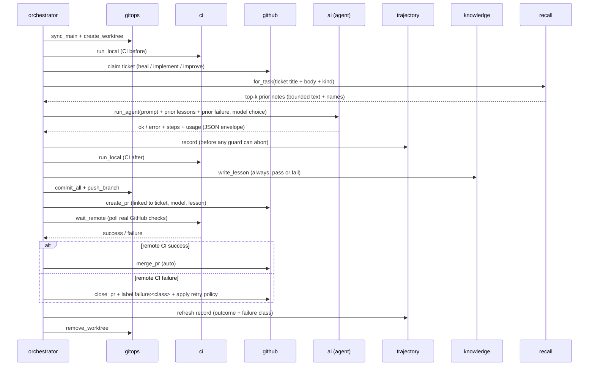

# Architecture

`hsai` is deliberately small. External side effects live in thin wrapper modules
so the decision logic stays pure and unit-tested.

## Modules

| module | responsibility | side effects |
| --- | --- | --- |
| `hsai.config` | load & validate `.ai-swarm/core.yaml` | read file |
| `hsai.proc` | one subprocess wrapper (`run`) + `Runner` type | subprocess |
| `hsai.models` | task → model-tier selection (heuristic-v0) | none (pure) |
| `hsai.ai` | drive `claude -p`; enforce subscription-only | subprocess, env |
| `hsai.gitops` | worktrees, sync, branch, commit, push | git |
| `hsai.github` | tickets, labels, PRs, merge | gh |
| `hsai.ci` | local CI gate (ruff+pytest) + remote status | subprocess |
| `hsai.failures` | failure taxonomy + retry policy (`classify`, `action_for`) | none (pure) |
| `hsai.trajectory` | one durable record per iteration; redaction, replay | write files |
| `hsai.journal` | append-only per-block step journal; `once()` replay | write files |
| `hsai.knowledge` | lessons, whitepapers, MOC reindex (Obsidian) | write files |
| `hsai.recall` | BM25 index over the vault; retrieve prior notes | read files |
| `hsai.orchestrator` | one iteration; `decide_path`, `build_pr_body` (pure) | composes above |
| `hsai.swarm` | run N iterations concurrently | threads |
| `hsai.cli` | `hsai` entry point | - |

## One iteration, sequence



## The knowledge base is read-write

For a long time the vault was write-only: every iteration appended a lesson and
no iteration ever read one, so each hard-won conclusion had to be re-encoded as
a hard-coded guard and the same classes of mistake recurred. `hsai.recall`
closes the loop.

- **Index.** `Corpus.load(root, cfg)` builds a BM25 index, on demand and in
  memory, over `knowledge/lessons`, `knowledge/whitepapers` and `docs/adr`.
  No third-party dependency, no model call, no network - so retrieval is free
  and its ranking is exactly reproducible (ties break on note name).
- **Bias.** Notes tagged `outcome/fail` are up-weighted by
  `knowledge.recall.fail_weight`; notes whose `kind/` matches the current task
  are up-weighted by `kind_weight`. Failures are the expensive knowledge, and a
  heal worker should see heal history.
- **Inject.** `orchestrator._task_prompt` appends a *Prior lessons from this
  repo* section of at most `k` wikilinked notes, hard-capped at `max_chars`;
  whole notes are dropped to fit, never truncated mid-line. An empty corpus or
  `enabled: false` renders nothing at all.
- **Plan.** `synthesis.build_prompt` carries an *Already tried in this repo*
  digest - prior lesson titles with pass/fail outcomes plus the titles of
  synthesis tickets still open - so the planner stops re-proposing dead ideas.
- **Audit.** What was retrieved is recorded three times: on `IterationResult`,
  as a `recalled:` list in the lesson's frontmatter, and as a
  *Prior lessons consulted* section on the PR. `hsai recall "<query>"` prints
  the same ranking by hand.

Reference-set lineage: retrieval-before-planning from `assafelovic/gpt-researcher`,
index-then-retrieve with metadata preserved from `run-llama/llama_index`, and
scoped agent memory from `OpenBMB/ChatDev`.

## Testability

Every wrapper takes an injectable `runner` (default: real subprocess). Tests
inject a fake runner or use `dry_run=True`, so CI never touches the network.
The pure core - `decide_path`, `build_pr_body`, `models.select`, the knowledge
renderers - is tested directly.

## Safety model

- **Subscription-only:** `ai.preflight` refuses to run if `ANTHROPIC_API_KEY`
  is present but not declared removable; the child env is always sanitized.
- **Never commit to main:** all work happens on `hsai/iter-*` branches in
  dedicated worktrees.
- **Green-gated merges:** merges use `gh pr merge --auto`; with branch
  protection requiring the `ci` check, broken changes simply never merge.
- **Traceability:** no PR without a ticket, a recorded model, and a lesson.

## Observability: trajectories

`claude -p` is invoked with `--output-format <execution.output_format>`
(default `json`), so every run returns a structured envelope (final result,
message stream, token usage, session id) instead of an opaque blob. The flag is
config-driven rather than hardcoded so a CLI change is a YAML edit, not a code
change: setting the key to `text` drops the flag and every consumer falls back
to the plain-text path.

`orchestrator.run_once` hands that envelope to `trajectory.record` at the
single choke point right after `ai.run_agent` - *before* the workflow,
completeness and reproduce-before-fix guards can return early - and writes one
JSON file per iteration to
`knowledge/trajectories/<block>/<iteration>-<branch>.json`. **Every** iteration
gets exactly one, including a dry run (which records that no model was called -
itself an auditable fact about the block) and one a guard aborted seconds
later. The record is refreshed, not duplicated, at each terminal exit, so the
final outcome (`merged`, `recovered`, `incomplete`, `no_repro`,
`workflow_tamper`, ...) and the failure class are folded back in.

One record is the whole forensic picture of an iteration, not just the agent
call: the prompt and its digest, model / tier / selection strategy, each
guard's verdict, local CI step results before and after, the remote CI
conclusion, a changed-path diffstat, per-phase durations, the failure class and
its reason, and a truncated tail of the agent's stdout and stderr.

Two properties make it safe to commit these:

- **Redacted.** `Trajectory.as_record()` runs `redact_value` over every string
  before anything reaches disk: API-key-shaped values, gh tokens, `KEY=VALUE`
  pairs whose key looks secret, and absolute home paths (which name the machine
  *and* its user, and appear in every worker prompt). A trajectory can be
  shared as-is.
- **Bounded.** `MAX_RECORD_CHARS` caps one record: a run that would exceed it
  sheds its earliest steps - a failure shows up at the *end* of a run - then
  clips its long free-text fields, and says `truncated: true`. `hsai cycle`
  prunes whole block directories beyond `execution.trajectory_retention_blocks`,
  so the store is bounded per record *and* over time. Git history keeps what
  the working tree drops.

`hsai traj <iteration> [--json]` reconstructs one - prompt, step stream, guard
verdicts, exit status, usage - purely by reading the file, with no `claude`
subprocess and no quota spent. (`hsai replay` is an alias.) The lesson and PR
body still carry only `Trajectory.digest()` plus, in the lesson,
`Trajectory.excerpt()` - a secrets-scrubbed tail - because a lesson is prose
for a human and a trajectory is evidence for a machine.

The same envelope feeds `ledger.parse_tokens` (which accepts the parsed payload
directly), so the quota ledger's token columns - and the block aggregate in the
review brief, including **tokens per merged PR** - report real numbers instead
of nulls. Output that is not JSON (an older `claude` binary) degrades to a
single-step trajectory with null usage rather than breaking the loop.

## Failure taxonomy and the adaptive retry policy

Every failed iteration used to be handled identically: close the PR, bump
`attempts:N`, unassign, and let the next worker retry with the same tier and a
byte-identical prompt. `hsai.failures` replaces that with a diagnosis.

**Classify.** `failures.classify(signals)` is pure: it reduces everything one
iteration observed - guard verdicts, agent exit status, local CI steps, the
remote conclusion, a rejected push - to exactly one class over an ordered rule
list. Signals co-occur constantly, so the order *is* the specification:

| # | class | fires when |
| --- | --- | --- |
| 1 | `workflow_tamper` | the worker edited `.github/workflows/**` |
| 2 | `guard_incomplete` | a code ticket produced a knowledge-only diff |
| 3 | `guard_no_repro` | no failing-then-passing reproduction |
| 4 | `merge_conflict` | the branch could not be pushed cleanly |
| 5 | `timeout` | the agent, or the remote poll, ran out of clock |
| 6 | `agent_error` | `claude -p` exited non-zero |
| 7 | `lint` | `ruff check` failed locally |
| 8 | `test_failure` | `pytest` failed locally |
| 9 | `remote_infra` | remote CI was not green while local CI was |
| 10 | `unknown` | it failed and left no recognised signal |

Three precedence rules are load-bearing. Tampering beats everything: moving the
goalposts is a safety event, not a build error. A guard verdict beats a CI
signal: the guards reason about the *diff*, local CI only about the tree that
diff produced. `timeout` beats `agent_error`: a killed agent also exits
non-zero, so the generic signal would always mask the actionable one.

**Act.** `execution.retry_policy` in `core.yaml` maps each class to one of
`retry_same_tier`, `retry_with_remediation`, `escalate_timeout`, `demote_tier`
or `block_immediately`; unset classes fall back to
`failures.DEFAULT_RETRY_POLICY`, and a typo surfaces as a `hsai doctor`
warning rather than silent drift. `_recover_failed` consults it, labels the
ticket `failure:<class>`, and applies the action.
`workflow_tamper` and `merge_conflict` block immediately - neither is fixable
by running the same prompt again - and blocking deliberately does **not**
consume an attempt, so the ticket reaches the architect with its retry budget
intact.

**Carry it forward.** The `failure:<class>` label is the durable channel
between attempts. The next worker to claim the ticket reads it back, resolves
the same action, and applies it: one tier cheaper (`demote_tier`), a doubled
agent timeout (`escalate_timeout`), and/or a bounded *Previous attempt failed*
section in its prompt, drawn from the prior trajectory's
`failure_excerpt()` - the class, why it fired, the guard and CI verdicts, and a
short redacted tail. The stale label is cleared on claim so this attempt's
verdict is unambiguous.

**Surface it.** `LedgerRecord.failure_class` puts the class in the ledger,
`BlockAggregate.failure_counts` folds a block's classes together, and a
**Failure taxonomy** table renders in both the review brief and the block
whitepaper (built from the `failure/<class>` tag on each lesson, so the
whitepaper needs only the vault). Three `guard_incomplete` rows say the prompt
is wrong; three `remote_infra` rows say the environments diverged. Both used to
read as "3 failed iterations".

Reference-set lineage: `run-llama/llama_index` (`issue_classifier.yml` -
classify incoming work so it can be routed rather than hand-triaged; and its
treatment of per-run telemetry as a shipped feature), `SWE-agent` (trajectory
files as the unit of debugging an autonomous run), `OpenBMB/ChatDev` (reflect
between phases before acting again) and `assafelovic/gpt-researcher` (its
batch-by-theme history: group failures into classes first, then fix them as a
class).

## Durability: the cycle journal

A block is a long chain of expensive, side-effecting steps - synthesis, N
implementations, a whitepaper, persona articles, a governance PR, a review
issue. `hsai.journal` makes that chain restartable: every step appends one JSON
line to `.hsai/cycles/<cycle_index>/journal.jsonl` *after* it completes, and
`run_cycle` wraps each one in

```python
payload = journal.once(jr, "whitepaper", "block", write_the_whitepaper)
```

On a first run the callable executes and its payload is journaled; on a resumed
run the recorded payload is returned and the callable never runs. Effects are
therefore at-least-once (a step killed mid-flight leaves no record and is
retried) and *completed* steps are at-most-once - so `hsai cycle --resume` files
no duplicate ticket, opens no second review issue, and spends no quota twice.
Because the report is rebuilt from the replayed payloads, a resumed block
produces the same brief an uninterrupted one would have, plus one `resume:
replayed N recorded step(s)` line in its Notes.

Two statuses close a journal: `halted` (the budget gate hard-breached and
stopped new work) and `complete`. `hsai cycle --resume` with no index picks the
most recent block whose journal has neither - so a finished block is never
re-run, and a halted one is never restarted under a breached ceiling. The
pre-iteration budget verdict is journaled alongside the iteration itself:
re-grading it from the ledger on a replay would see the whole block's spend
before iteration 0 and halt immediately.

The journal lives under `.hsai/` (gitignored): it is local operational state
for resuming a block, not evidence about a change - unlike a trajectory, which
is committed. `--dry-run` journals into
`journal.dry-run.jsonl` so a rehearsal can neither satisfy nor poison a later
live run of the same block.

## Headless permission mode

`claude -p` runs with `execution.permission_mode` from `core.yaml`
(default `acceptEdits`). For fully unattended operation this can be raised, at
the cost of granting the agent broader autonomy inside its worktree. Because
merges are green-gated, a bad change is contained to an unmerged PR.

## Concurrency

`swarm.run_parallel` uses a thread pool (workers are subprocess/IO-bound). Each
worker gets its own worktree and branch, so there is no shared checkout.

Three things make parallel workers safe:

1. **Serialized prologue + ticket claim.** A single `orchestrator._SERIAL` lock
   wraps only the fast, shared-state operations: the git prologue
   (`fetch` + `worktree add`) and the ticket decision/claim. The slow work
   (agent, CI, push, PR, merge) runs fully in parallel.
2. **No shared working tree.** `gitops.sync_main` only *fetches*; worktrees are
   created from `origin/<main>`, so the shared checkout is never mutated and
   `git`'s index lock is never contended.
3. **Claim by assignment.** A worker considers only *unassigned* open tickets and
   assigns itself immediately under the lock, so N workers never grab the same
   ticket. Unique per-worker branch names avoid collisions within one second.

**Derived index files stay out of PRs.** Each PR commits only its uniquely-named
lesson file plus code. The MOC indexes and whitepapers are regenerated by the
serialized `hsai reindex` maintenance step, so concurrent PRs never conflict on
shared, regenerated files. The shared integration surface is the GitHub backlog
and `main`; green-gated auto-merge serializes the actual integration.

## Reliability: CI parity, remote truth, and recovery

- **Remote CI is the source of truth.** After opening a PR, `run_once` calls
  `ci.wait_remote`, which polls the PR's real GitHub check rollup until it
  concludes - this is an explicit pre-merge gate, checked *before* auto-merge
  is ever armed. Local `run_local` (ruff+pytest) is only a fast pre-flight;
  the merge decision follows the remote result. The remote conclusion is
  written back into the lesson (and pushed as a follow-up commit) so the
  knowledge base records the true CI outcome for every PR, not just the
  local approximation.
- **Local == remote by construction.** A task must not change the CI checks, or
  local and remote would diverge. The orchestrator reverts any edits under
  `.github/workflows/**` *and stops the iteration* (`workflow_tamper`): a
  half-reverted diff whose remaining half assumed the new workflow is not worth
  shipping, and a worker moving the goalposts it is judged by is a safety event
  that belongs with a human.
- **A failed push is not a PR.** If `git push` is rejected the iteration stops
  rather than opening a PR against a branch that is not on origin (which used
  to yield PR #0 and a nonsense remote poll). A rejected push classifies as
  `merge_conflict` and blocks.
- **No ticket is stranded on failure.** If remote CI does not go green,
  `_recover_failed` closes the PR (deleting the branch), labels the ticket with
  its failure class, and applies the configured retry action - normally
  returning it to the backlog with an incremented `attempts:N` label. After
  `execution.max_ticket_attempts`, the ticket is labelled `blocked` and left for
  a human; blocked/assigned tickets are skipped by future workers.
