# Architecture

`hsai` is deliberately small. External side effects live in thin wrapper modules
so the decision logic stays pure and unit-tested.

## Modules

| module | responsibility | side effects |
| --- | --- | --- |
| `hsai.config` | load & validate `.ai-swarm/core.yaml` | read file |
| `hsai.proc` | one subprocess wrapper (`run`) + `Runner` type | subprocess |
| `hsai.models` | task → model-tier selection + machine-readable rationale | none (pure) |
| `hsai.calibration` | learn selection thresholds from lessons (heuristic-v2) | read/write params artifact |
| `hsai.ai` | drive `claude -p`; enforce subscription-only | subprocess, env |
| `hsai.gitops` | worktrees, sync, branch, commit, push | git |
| `hsai.github` | tickets, labels, PRs, merge | gh |
| `hsai.ci` | local CI gate (ruff+pytest) + remote status | subprocess |
| `hsai.knowledge` | lessons, whitepapers, MOC reindex (Obsidian) | write files |
| `hsai.orchestrator` | one iteration; `decide_path`, `build_pr_body` (pure) | composes above |
| `hsai.swarm` | run N iterations concurrently | threads |
| `hsai.cli` | `hsai` entry point | - |

## One iteration, sequence

```mermaid
sequenceDiagram
    participant O as orchestrator
    participant G as gitops
    participant C as ci
    participant H as github
    participant A as ai (agent)
    participant K as knowledge

    O->>G: sync_main + create_worktree
    O->>C: run_local (CI before)
    O->>H: claim ticket (heal / implement / improve)
    O->>A: run_agent(prompt, model choice)
    A-->>O: ok / error
    O->>C: run_local (CI after)
    O->>K: write_lesson (always, pass or fail)
    O->>G: commit_all + push_branch
    O->>H: create_pr (linked to ticket, model, lesson)
    O->>C: wait_remote (poll real GitHub checks)
    C-->>O: success / failure
    alt remote CI success
        O->>H: merge_pr (auto)
    else remote CI failure
        O->>H: close_pr + return ticket to backlog
    end
    O->>G: remove_worktree
```

## Testability

Every wrapper takes an injectable `runner` (default: real subprocess). Tests
inject a fake runner or use `dry_run=True`, so CI never touches the network.
The pure core - `decide_path`, `build_pr_body`, `models.select`, the knowledge
renderers - is tested directly.

## Model selection, learned

`models.select` scores a task and compares that score against two thresholds.
Those thresholds are *data*, not constants: `hsai calibrate` folds the lesson
corpus (tier used, pass/fail, kind, attempt) into
`.ai-swarm/model-selection.json`, and `hsai cycle` refreshes it once per block
so the next block selects on fresher evidence.

- **heuristic-v1** - the static keyword+structure heuristic. Still the fallback
  whenever the artifact is missing, unreadable, or the corpus is too thin.
- **heuristic-v2** - the same scoring with calibrated thresholds. Movement is
  clamped (`max_threshold_delta`) and gated on sample counts and per-tier share
  so a small or biased corpus cannot collapse everything onto `opus` (quota) or
  `haiku` (quality).
- **Escalate-on-retry** - attempt > 1 bumps the tier one level per prior
  attempt, so a ticket's last attempt is not spent on the model that already
  failed it. A soft budget breach still outranks it.

Every selection records both a human rationale and a machine-readable signal
list on the PR (`**signals**`) and in the lesson, which is what the next
calibration reads back.

## Safety model

- **Subscription-only:** `ai.preflight` refuses to run if `ANTHROPIC_API_KEY`
  is present but not declared removable; the child env is always sanitized.
- **Never commit to main:** all work happens on `hsai/iter-*` branches in
  dedicated worktrees.
- **Green-gated merges:** merges use `gh pr merge --auto`; with branch
  protection requiring the `ci` check, broken changes simply never merge.
- **Traceability:** no PR without a ticket, a recorded model, and a lesson.

## Headless permission mode

`claude -p` runs with `execution.permission_mode` from `core.yaml`
(default `acceptEdits`). For fully unattended operation this can be raised, at
the cost of granting the agent broader autonomy inside its worktree. Because
merges are green-gated, a bad change is contained to an unmerged PR.

## Concurrency

`swarm.run_parallel` uses a thread pool (workers are subprocess/IO-bound). Each
worker gets its own worktree and branch, so there is no shared checkout.

Three things make parallel workers safe:

1. **Serialized prologue + ticket claim.** A single `orchestrator._SERIAL` lock
   wraps only the fast, shared-state operations: the git prologue
   (`fetch` + `worktree add`) and the ticket decision/claim. The slow work
   (agent, CI, push, PR, merge) runs fully in parallel.
2. **No shared working tree.** `gitops.sync_main` only *fetches*; worktrees are
   created from `origin/<main>`, so the shared checkout is never mutated and
   `git`'s index lock is never contended.
3. **Claim by assignment.** A worker considers only *unassigned* open tickets and
   assigns itself immediately under the lock, so N workers never grab the same
   ticket. Unique per-worker branch names avoid collisions within one second.

**Derived index files stay out of PRs.** Each PR commits only its uniquely-named
lesson file plus code. The MOC indexes and whitepapers are regenerated by the
serialized `hsai reindex` maintenance step, so concurrent PRs never conflict on
shared, regenerated files. The shared integration surface is the GitHub backlog
and `main`; green-gated auto-merge serializes the actual integration.

## Reliability: CI parity, remote truth, and recovery

- **Remote CI is the source of truth.** After opening a PR, `run_once` calls
  `ci.wait_remote`, which polls the PR's real GitHub check rollup until it
  concludes - this is an explicit pre-merge gate, checked *before* auto-merge
  is ever armed. Local `run_local` (ruff+pytest) is only a fast pre-flight;
  the merge decision follows the remote result. The remote conclusion is
  written back into the lesson (and pushed as a follow-up commit) so the
  knowledge base records the true CI outcome for every PR, not just the
  local approximation.
- **Local == remote by construction.** A task must not change the CI checks, or
  local and remote would diverge. The orchestrator reverts any edits under
  `.github/workflows/**` before committing (and notes it in the lesson), so a
  worker cannot (accidentally or otherwise) move the goalposts it is judged by.
- **No ticket is stranded on failure.** If remote CI does not go green,
  `_recover_failed` closes the PR (deleting the branch) and returns the ticket
  to the backlog with an incremented `attempts:N` label. After
  `execution.max_ticket_attempts`, the ticket is labelled `blocked` and left for
  a human; blocked/assigned tickets are skipped by future workers.
